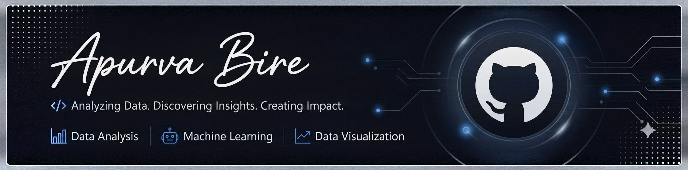

  

# Hi, I'm Apurva Bire 👋

### Computer Science & Engineering (Data Science) Graduate

Passionate about transforming data into actionable insights through analytics, visualization, and machine learning.

 

## 📂 Explore My Work

Explore my repositories to discover Python-based projects, data analytics solutions, interactive dashboards, and machine learning implementations.

 

## 🤝 Let's Connect

Open to professional collaborations, networking, and new opportunities.

 

## 🛠️ Tech Stack

  

  

